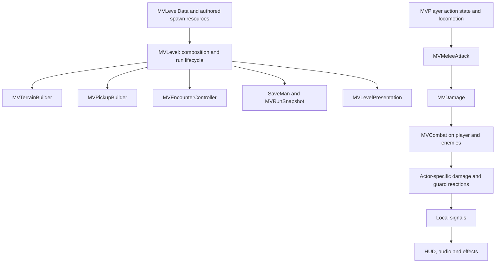

# Game architecture

This implements all five recommendations from the design audit. The work keeps the existing movement constants, areas and enemy roles, while making action transitions, combat, content construction, saving and presentation separate responsibilities.

## Ownership and dependencies

### Player action state

`MVPlayer.Action` is the authoritative state: Normal, Dash, PoundWindup, PoundFall, Hurt or Dead. `TRANSITIONS` lists allowed transitions. Inputs may request actions only in allowed states. Entering hurt or death clears pending attacks and jumps; entering pound cancels melee. A successful stomp returns to Normal, applies a bounce and grants a short contact grace period. Respawn is the explicit transition out of Dead.

The `dead`, `pounding`, `dash_timer`, `hurt_t`, `hp`, `invuln` and attack timer properties remain as adapters for existing visuals/tests. They delegate to the state or combat components rather than storing another independent copy. Add new actions through the transition table and their physics branch, not another boolean. Knockback gets a 0.3-second Hurt state instead of being immediately overwritten by locomotion.

### Shared combat

Every damageable actor owns a child named `Combat` with an `MVCombat` script. Deliver an `MVDamage` through `MVDamage.deliver(target, hit)`. Slash, impact and contact damage all use that contract. Player `take_damage`, skeleton `take_hit` and `squash` remain compatibility entry points that delegate to it.

`MVCombat` owns health, healing, invulnerability and health/death signals. A pure actor-specific `damage_policy` returns a damage amount, zero for blocking, or `STAGGER` for guard breaking. Actor callbacks handle movement reactions and phase changes. The same receiver supports shield direction, boss guard breaks, dash immunity and ordinary damage without duplicate health implementations.

`MVMeleeAttack` owns active time, cooldown, buffering and the per-swing hit set. A local physics overlap query finds nearby bodies, followed by directional/range filtering. Pound uses the same nearby query. The query is bounded at 256 results; the current encounters are much smaller. A future crowd mode should profile/query-budget this explicitly. Current collision layers are player=1, enemies=2, terrain=4.

### Level construction

`MVLevel` is the composition root. It initializes a run or restores it, connects local events to persistence, configures the camera and coordinates death/area completion. It delegates:

- **MVTerrainBuilder:** static collisions and breakable placements.
- **MVPickupBuilder:** orbs, hearts and checkpoint placements/restoration.
- **MVEncounterController:** enemies, boss lifetime, exit lock and encounter resets.
- **MVLevelPresentation:** background, signs, music, lights and atmosphere.
- **MVTerrainVisual:** terrain rendering, independent of collision construction.

Builders emit `world_changed(id)`; they do not write save files. The level adds area context and synchronizes the clock before saving an event. The encounter controller explicitly binds the boss HUD, avoiding a global group search every frame.

### Permanent content identities

Each area has an authored `area_id`. Each enemy/orb spawn carries `persistence_id`. Hearts, checkpoints and breakable floors now use `MVWorldSpawn` resources containing an ID and position (plus size for floors). Bosses have a `boss_id`.

IDs are strings stored in the content file, not calculated from positions or array indexes. Move/reorder the resource without changing its ID. When duplicating an object for new content, assign the copy a new ID. Never reuse an old ID for a different reward. `MVLevelData.validation_errors()` rejects missing/duplicate IDs within an area. New areas must also choose distinct area IDs; global area uniqueness is an authoring convention.

The old `data.cracked`, `data.hearts` and `data.checkpoints` arrays remain read-only derived views for existing code. Author new content through `breakables`, `heart_spawns` and `checkpoint_spawns`. Both shipped `.tres` files have been migrated.

### Versioned save snapshot

`MVRunSnapshot` version 2 contains abilities, area path, checkpoint plus its area, completed-area time, current-area time, completion status and per-area permanent world IDs. Lifetime records remain separate from a run.

`SaveMan` is the single file writer, including mute-setting updates requested by AudioMan. It preserves other config sections, writes a temporary file, retains a backup of the previous valid file, then replaces the primary. Failure leaves the snapshot dirty and emits `save_failed`. Unversioned saves migrate; unknown ability IDs and malformed fields are filtered. Newer schema versions are not overwritten. A corrupt primary can recover from the backup. Legacy files contain no world IDs or area time, so those fields start empty/zero during migration.

The clock updates in memory during gameplay, flushes at one-second intervals, and flushes on focus loss, pause-to-title/scene exit and application pause/close notifications. World events and area completion save immediately. An abrupt crash or forced browser termination can still lose roughly the last second; this is local persistence, not a tamper-proof leaderboard.

#### Recovery contract

| State | Death / checkpoint retry / Continue |
| --- | --- |
| Abilities and collected orbs | Retained |
| Collected hearts | Remain collected |
| Activated checkpoints | Remain activated |
| Opened breakable floors / shortcuts | Remain open |
| Defeated enemies and boss | Remain defeated |
| Surviving enemies and boss | Return to their authored positions, full health and initial guard/phase |
| Projectiles | Cleared |
| Player | Full health at last checkpoint, or area start |
| Run clock | Continues; no reset on Continue or retry |

Pause-menu restart now means checkpoint retry. PLAY AGAIN after the final clear begins a new run in area one. New Run clears progress/world IDs but keeps best time and clear count. Completed runs cannot Continue and completion is idempotent. Area transitions bank the current area's accumulated time once through the guarded level completion handler.

### Presentation boundaries

Player/enemy rules emit local feedback events; `player_feedback.gd`, `enemy_feedback.gd` and `world_feedback.gd` play sounds and effects. World objects emit collected/broken/claimed/unlocked/won signals. Their drawing remains in visual code. `MVCameraRig` composes directional lead with JuiceMan's shake offset. Combat/locomotion never writes camera shake or plays sound directly. No global event bus was introduced.

## Verification

Run `python tools/verify.py <Godot executable>`. Use repeated `--suite run_architecture` / `--suite run_combat_contract` options for focused checks. Every suite gets an isolated save directory and a timeout; the runner requires a success marker and rejects script errors even if the engine returns zero. CI uses this same runner.

New coverage includes legacy migration, malformed fields, future-version protection, backup recovery, ID stability after moving/reordering content, elapsed-time restoration/focus flush, world persistence, death/reload parity, boss exit restoration, and completion/new-run behavior. Combat tests use real collision bodies and check active windows, one hit per target, buffering, immunity, forbidden transitions and stomp recovery. Existing traversal, encounter, touch-layout and transition suites remain in use.

Expected malformed-file diagnostics are deliberately produced by the corruption test. Some headless runs report audio-stream shutdown warnings; the native rendering smoke test exits cleanly. Automated boss combat comes in three grades: bossfight teleports into tactical positions (regression evidence only), bossfair restricts itself to key presses, and bossclumsy handicaps those presses -- 180ms reaction, imprecise aim, dropped inputs -- and sweeps seeds for a win rate, which is the closest thing here to evidence about human difficulty. A rendered native arena screenshot is checked; keyboard/touch playtesting remains valuable after this refactor.

### Verified result

Godot 4.7.2: **18/18 suites passed**, including script compilation. The native arena render completed without runtime errors. Two successive web exports matched byte-for-byte; the exported files were copied to `docs/`. `build/.gdignore` prevents generated builds and diagnostic sources from being imported into the project. Changes are local to `codex/gameplay-improvements`; no publishing or Pages configuration changes were performed.
